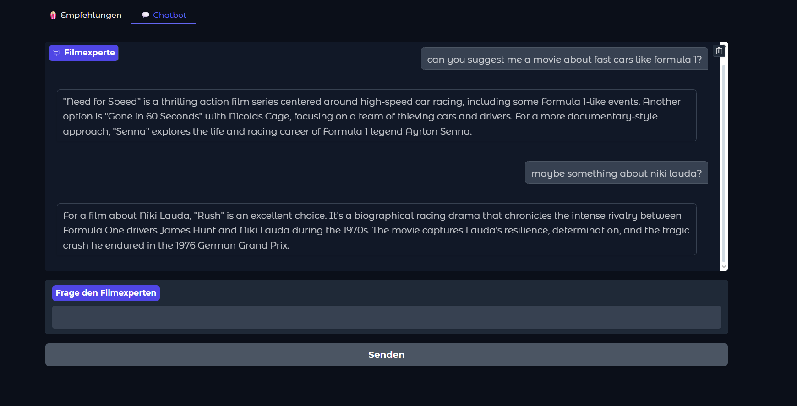
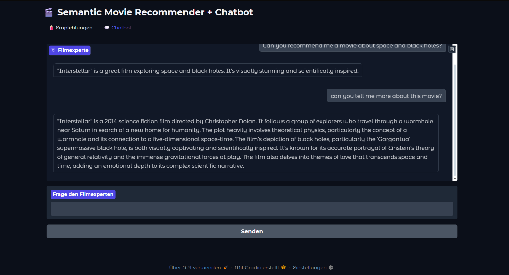
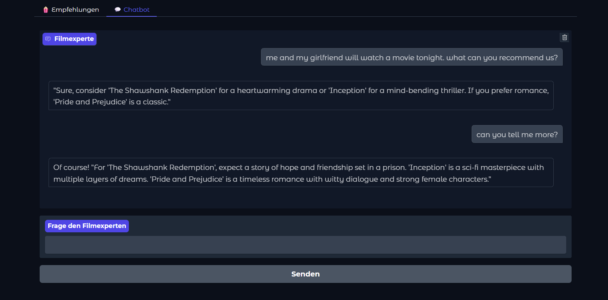

# 🤖🎬 Movie Chatbot


> **“Chat your way to your next favorite movie.”**  
> A semantic movie chatbot that leverages **three LLMs**: one for embeddings, one for precise reranking, and a third for generating natural, conversational responses.

---

## 🚀 What It Does

- 🧠 **Semantic search** over a movie dataset using embeddings + reranking  
- 💬 **Chatbot interface** powered by an LLM for natural, conversational recommendations  
- 🎨 Interactive **Gradio chat UI** for seamless user experience  
- 📚 Returns recommended movies with posters, descriptions, and reasoning  

---

## ✨ Features

- 🗨️ **Full chatbot interface** – ask questions, get movie suggestions naturally  
- 🔍 **Two-stage retrieval** → Embedding search + Cross-Encoder reranking  
- 🎯 **Chat LLM** generates conversational answers, explains recommendations  
- 🖼️ **Poster previews** for each suggested movie  
- 🌈 **Gradio Blocks UI** with clean and modern theme  
- 🛠️ **Easily extendable** – swap models, add datasets, or customize responses  

---

## 🧰 Tech Stack

  
  
  
  
  

---

## 📸 Demo – Example Queries

Try the following prompts in the Chatbot:

- **"A movie about fast cars"**  
- **"A movie about space"**  
- **"A movie about sex and romance"**

Output examples:

<p align="center">
  
  
  
</p>

---


## ⚡ Quickstart

I would recommend you to use my kaggle notebook to start and demo the semantic recommender
(https://www.kaggle.com/code/tomy00/upgraded-chatbot)

Or otherwise you use the code yourself


```bash
# Clone repo
git clone https://github.com/YourUser/Semantic-Movie-Chatbot.git
cd Semantic-Movie-Chatbot

# (Optional) Create virtual environment
python -m venv venv
source venv/bin/activate   # Linux/Mac
# .\venv\Scripts\activate  # Windows

# Install dependencies
pip install -r requirements.txt

# Run the chatbot
python main.py
